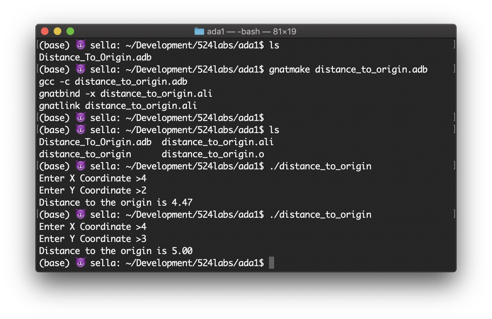
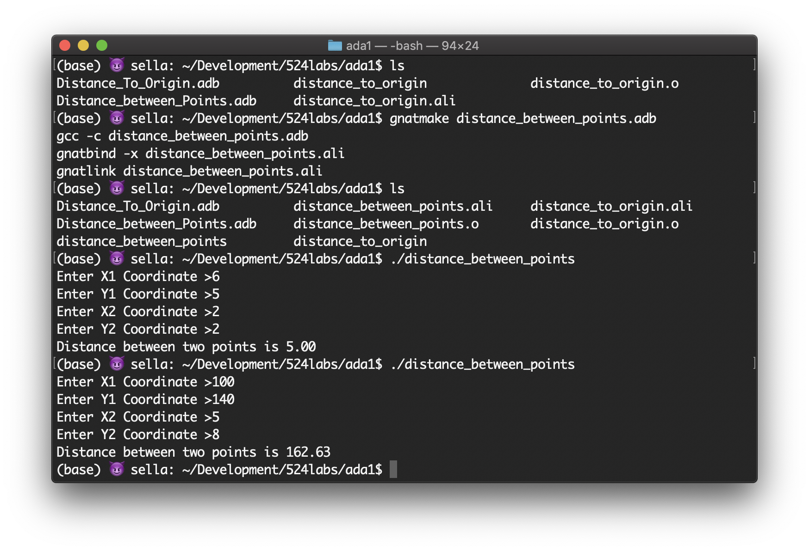

# CECS524 Lab Ada1. Distance_between_points
Apr 25, 2019

screenshots
1. Distance_to_Origin

2. Distance_to_Origin



### Assignment details
Turn in one Word file or pdf
A screen shot of the output of Distance_To_Origin.adb for at least one run
The modified Ada file Distance_To_Origin.adb saved as Distance_between_Points.adb
A screen shot of the output of the modified program from 2.
Ada! Our first. Let’s start off simple: cut and paste the code below into a text (notepad, wordpad, etc) editor and save the file as Distance_To_Origin.adb. This short program introduces several topics:
Ada program structure – a single “main” and no subs
Ada RECORD types – not all that different from a struct in C
Simple Ada IO – each data type has its own
“Importing” libraries into Ada programs – WITH
Elipitcal references with USE
How to compile, link and execute an Ada program
Here it is:
```
WITH Ada.Text_IO;
WITH Ada.Float_Text_IO;
WITH Ada.Numerics.Elementary_Functions;
USE  Ada.Numerics.Elementary_Functions;

PROCEDURE Distance_to_Origin IS
	TYPE Point IS RECORD
		X : Float;
		Y : Float;
	END RECORD;

	Point1 : Point;
	Distance : Float;

	BEGIN
		Ada.Text_IO.Put(Item => "Enter X Coordinate >");
		Ada.Float_Text_IO.Get(Item => Point1.X);
		Ada.Text_IO.Put(Item => "Enter Y Coordinate >");
		Ada.Float_Text_IO.Get(Item => Point1.Y);
		Distance := Sqrt(Point1.X ** 2 + Point1.Y ** 2);
		Ada.Text_IO.Put(Item => "Distance to the origin is ");
		Ada.Float_Text_IO.Put(Item => Distance, Fore=>1, Aft=>2,Exp=>0);
		Ada.Text_IO.New_Line;
	END Distance_to_Origin;
```
To compile and run the code!
