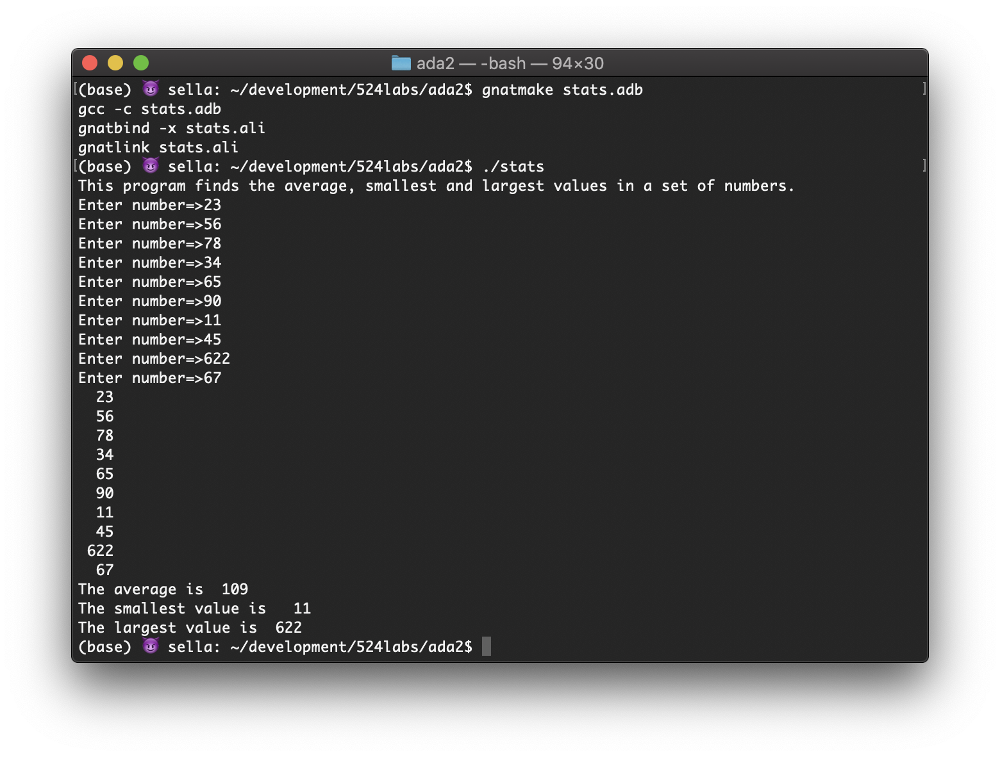

## CECS524 Ada Lab2
# Ada Arrays


### Assignment details
This program takes 10 "natural" numbers from the user through the keyboard, computes their average, finds the minimum and maximum values, and writes the numbers to the screen followed by the statistics.  
Complete the missing functions. The missing bits are Min, Max and PrintArray. Min and Max are obviously finding the minimum and maximum values in the array. PrintArray is printing the array elements one per line. Do not assume the input is sorted.  
Reference the function Average for writing loops - or in the "main".   Ada IFs are pretty basic.
```
IF expr THEN statement END IF;
```
You should only need a single statement for Min and Max.  
