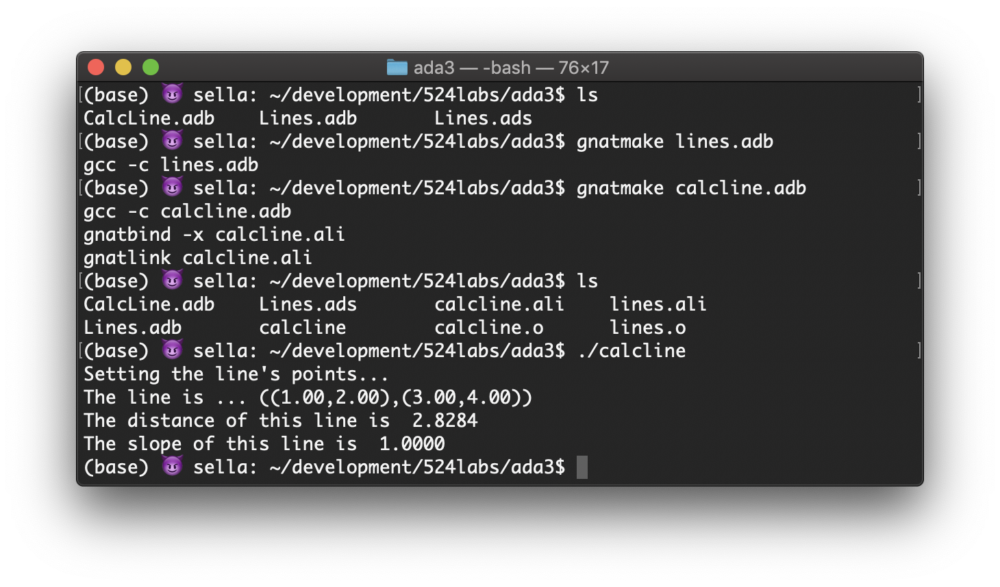

## CECS524 Ada Lab3
# Ada Packages
Ada program can be composed of packages. A package typically has two parts: a specification and a body!

### Files
- Lines.ads
specification of Lines
- Lines.adb
- CalcLine.adb
body part of Lines
"WITH" clause in CalcLine.adb for "Lines" the linker attempts to find the library (Lines.ali) as it does for "WITH" libraries.

### To compile and run
1. Compile Lines.adb
This connects specification(Lines.ads) and the body(Lines.adb)
```
$ gnatmake lines.adb
```
2. Compile CalcLine.adb
```
$ gnatmake calcline.adb
```
3. Run CalcLine
```
$ ./calcline
```

